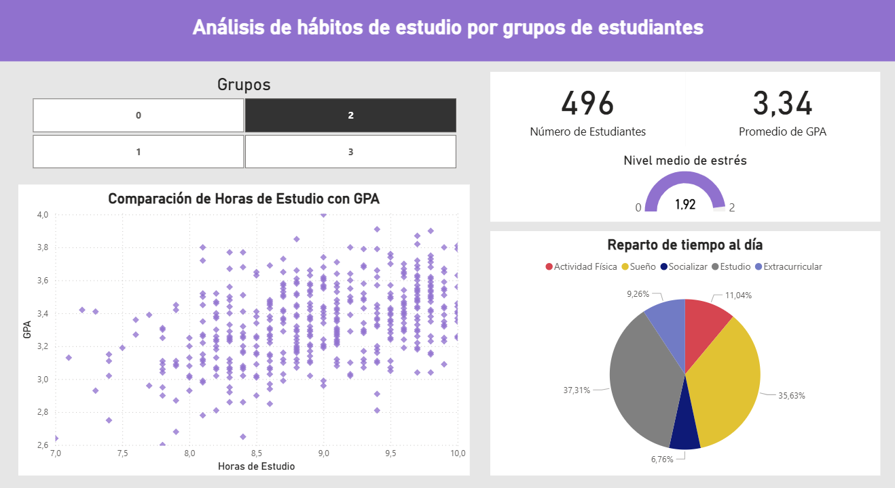
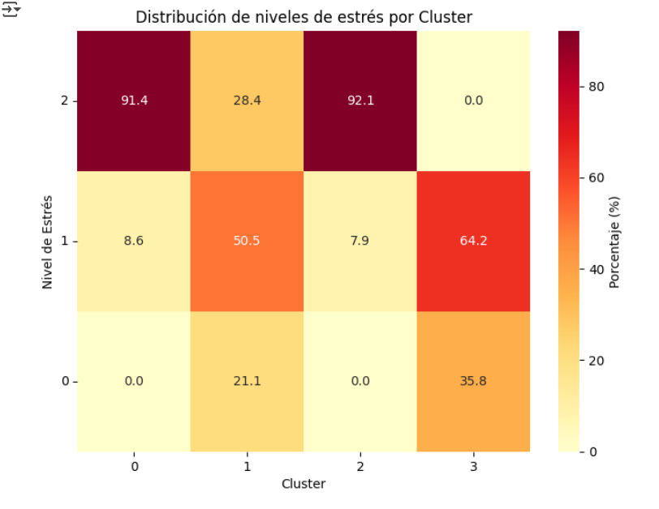
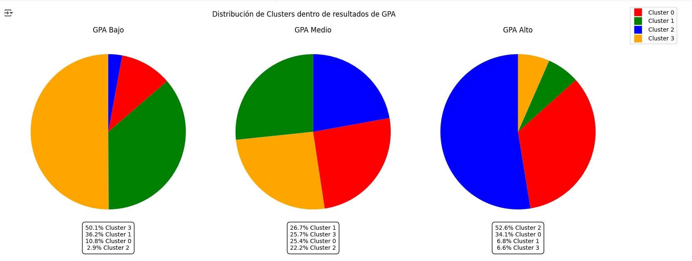

# Proyecto Clustering Students  

## Descripción  
Este es un proyecto de Machine Learning no supervisado en el que se aplica clustering para segmentar a 2000 estudiantes según sus hábitos de estudio. Los resultados se analizan e interpretan mediante un dashboard interactivo en Power BI.

---

## Estructura del Repositorio  
- data/ → contiene la información necesaria para entender el dataset y cómo utilizarlo
- notebooks/ → notebook .ipynb y script .py con el código
- powerbi/ → archivo .pbix con el dashboard interactivo en Power BI 
- images/ → captura del dashboard de Power BI y un par de imágenes de análisis hechos en el notebook
- requirements.txt → librerías necesarias para ejecutar el proyecto
- README.md → documentación principal

---

## Instalación y Uso  
1. Clonar este repositorio:
   
    *git clone https://github.com/juanmacbet/proyecto-clustering-students.git*
3. Entrar en la carpeta del proyecto
4. Instalar las dependencias:
   
    *pip install -r requirements.txt*
6. Ejecutar el proyecto (elige una de las dos opciones):
    - **Opción A: Usar el Notebook**  
         - Abrir `notebooks/StudentsClustering.ipynb` en Jupyter Notebook  
         - O bien subir el notebook a Google Colab y ejecutarlo ahí
    - **Opción B: Usar el Script**  
         - Ejecutar directamente en terminal:
       
           *python notebooks/studentsclustering.py*

---

## Resultados
El modelo de clustering segmentó a los 2000 estudiantes en 4 clusters (grupos):

De ellos vamos a destacar como muestra a estos dos grupos:

- **Grupo 2:**
  
    - Son el grupo que presenta mayor estrés de media (el 92.1% presenta nivel 3 de estrés, el máximo posible).
      
    - Son el grupo que más horas dedica de media a estudiar.
      

- **Grupo 3:**
  
    - Son el grupo que presenta menor estrés de media (el 0% presenta nivel 3 de estrés).
      
    - Son el grupo que menos horas dedica de media a estudiar.

Un hallazgo interesante es que, aunque la variable GPA (medida de calificación académica) no fue usada en la segmentación de los estudiantes, presenta una fuerte correlación con los grupos, y esto podemos decirlo por dos razones:

La primera es que si mostramos el GPA promedio de estos dos grupos vemos lo siguiente:

    - Grupo 2: 3.34 (Presentan el mayor GPA promedio de entre los 4 grupos)
    
    - Grupo 3: 2.93 (Presentan el menor GPA promedio de entre los 4 grupos)

Y la segunda es que si del total de los estudiantes, los 2000, representamos al 25% de ellos con mayor GPA y al 25% con menor GPA, vemos lo siguiente:

    - 25% con mayor GPA: el 52.6% de ellos pertenece al Grupo 2 y tan solo el 6.6% pertenece al Grupo 3.
    
    - 25% con menor GPA: el 50.1% de ellos pertenece al Grupo 3 y tan solo el 2.9% pertenece al Grupo 2.
    

Esta es solo una de las muchas correlaciones y muchos patrones que se pueden deducir tras haber segmentado y analizado este dataset de estudiantes....

Como conclusión, este análisis demuestra que los algoritmos de clustering pueden ser una herramienta útil para segmentar estudiantes en función de sus hábitos y comportamientos, revelando patrones ocultos que luego se relacionan de manera clara con el rendimiento académico.

#### Limitaciones del análisis:
Este trabajo se ha realizado sobre un dataset limitado y sintético. Por tanto, los resultados y patrones observados no deben tomarse al pie de la letra ni generalizarse a todos los contextos educativos, sino entenderse como un ejercicio exploratorio de aplicación de técnicas de clustering.

---

### Visualizaciones
#### (Dashboard Power BI) Análisis Grupo 1:  

#### (Notebook) Estrés por grupos:  

#### (Notebook) Representación rangos de GPA:

---

## Tecnologías Utilizadas

- **Python** → Lenguaje principal para el análisis y modelado.  
- **Google Colab** → Entorno usado para desarrollar y ejecutar el notebook.  
- **scikit-learn** → Implementación de algoritmos de clustering (K-Means) y métricas (silhouette score).  
- **Pandas & NumPy** → Manipulación y análisis de datos.  
- **Matplotlib & Seaborn** → Visualización básica de datos.  
- **Plotly Express** → Visualización interactiva.  
- **Power BI** → Creación del dashboard final para representar los resultados de forma visual.  
- **Git & GitHub** → Control de versiones y publicación del proyecto.  

---

## Autor  

- **Juan Manuel Cano Betancourt**
- [GitHub](https://github.com/juanmacbet)
- [LinkedIn](https://www.linkedin.com/in/juan-manuel-cano-betancourt-1887401b7/)
- [Email](mailto:juanmacanobetancourt@gmail.com)

---

## Licencia

Este proyecto está bajo la licencia [MIT](./LICENSE).
